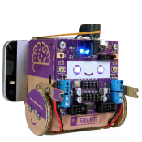

# The Crafty Robot Smartibot robot

The Crafty Roboto Smartibot was a kickstarter user-assembled robot launched on [Kickstarter](https://www.kickstarter.com/projects/460355237/smartibot-the-worlds-first-ai-enabled-cardboard-ro). It's claim to fame is that it's a cardboard
robot, which in practice means that the robot shell and wheels are cardboard and the electronics are stock electronics.

The Bluetooth connection is via the Nordic Semiconductor NRF system; the device is Bluetooth LE, but it includes
a service with a transmit and receive characteristics; these are used to send JavaScript commands to the device. The device specialization looks just like a terminal because that's what the device emulated.

The device uses the *Espruino* system to run JavaScript on the device. Somewhat confusingly, you will often see code like this:
    var smarti = require("Smartibot");
    smarti.setLEDs([255,0,0], [0,255,0

The *require* statement is handled by the Espruino development system. This program doesn't include the entire development system. Instead, the source code to the 

Set the screen to show three buttons wide; this results in the best set of controls. There are sliders for the arms 
and the head. You can set exactly values for the two drive motors (marked Left and Right) and the LED eyes and the 
light-up headphones. The lights take a value from 0 to 9 where 0 is off and 9 is the maximum brightness.

# Screen Shot

# Links
Some useful links to learn more about the BERO robot:

* [Crafty Robot](https://thecraftyrobot.net/collections/smartibot)
* [Espruino](http://www.espruino.com/Smartibot)
* [Kickstarter](https://www.kickstarter.com/projects/460355237/smartibot-the-worlds-first-ai-enabled-cardboard-ro)
* [Espruino Module](https://www.espruino.com/modules/Smartibot.js)
* [Reddit](https://www.reddit.com/r/Smartibot/)
* [License](https://www.espruino.com/modules/LICENSE)

The license is required for the Espruino module only.
