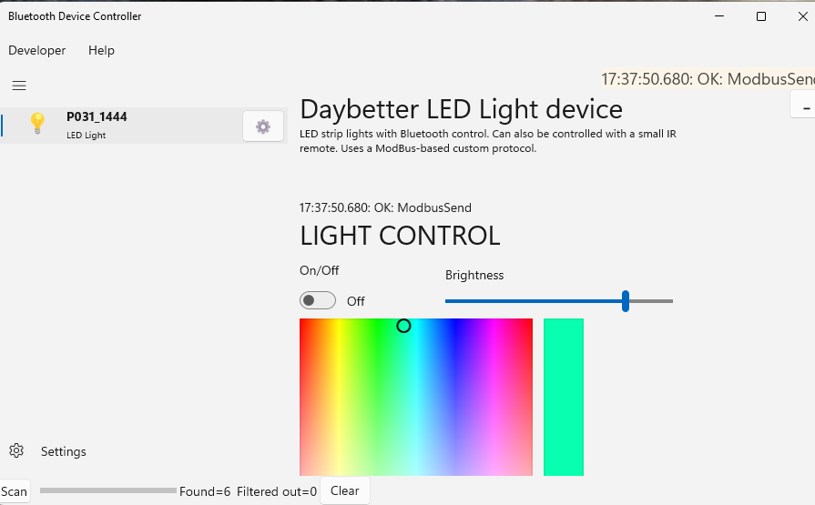

# The Daybetter LED Strip 

LED strip lights with Bluetooth control. Can also be controlled with a small IR remote. The light uses a Modbus-derived protocol. From the program you can turn the lights on and off, change the color, or change the brightness.

## Pairing and using the device
The LED does not need to be paired.

## Helpful Links

* [daybetter.com](https://daybetter.com/collections/rgbic-led-lights/products/daybetter-bluetooth-led-strip-lights-50-100ft)
* [Android app](https://daybetter.smartthingsapp.com/app/QRCode)
* [Github (shindekokoro/homebridge-daybetter)](https://github.com/shindekokoro/homebridge-daybetter/blob/master/Device.js)
* [Detail on the Modbus protocol](https://modbus.org/docs/Modbus_over_serial_line_V1_01.pdf)