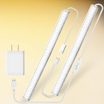

# The MATICOD (ELK) Led Light

MATICOD under-counter 'stick' LED light with Bluetooth control. Can also be controlled with a small remote, or via a tiny controller built into the power cord. Seems to use the same protocol as the ELK-BLEDOM controller.

## Pairing and using the device
The LED Light does not need to be paired. You can turn the light on and off, set the brightness, and set the warmth (warm is a redder light and cool is a bluer light)

## Helpful Links

* [https://www.amazon.com/dp/B0C1N8WSXF](https://www.amazon.com/dp/B0C1N8WSXF)
* [https://github.com/kquinsland/JACKYLED-BLE-RGB-LED-Strip-controller](https://github.com/kquinsland/JACKYLED-BLE-RGB-LED-Strip-controller)
* [https://github.com/arduino12/ble_rgb_led_strip_controller](https://github.com/arduino12/ble_rgb_led_strip_controller)
* [https://github.com/8none1/elk-bledob](https://github.com/8none1/elk-bledob)
* [https://github.com/lilgallon/DynamicLedStrips](https://github.com/lilgallon/DynamicLedStrips)
* [https://github.com/TheSylex/ELK-BLEDOM-bluetooth-led-strip-controller/blob/main/README.md](https://github.com/TheSylex/ELK-BLEDOM-bluetooth-led-strip-controller/blob/main/README.md)
* [https://github.com/FergusInLondon/ELK-BLEDOM/blob/master/proof-of-concept/demo.go](https://github.com/FergusInLondon/ELK-BLEDOM/blob/master/proof-of-concept/demo.go)
* [https://linuxthings.co.uk/blog/control-an-elk-bledom-bluetooth-led-strip](https://linuxthings.co.uk/blog/control-an-elk-bledom-bluetooth-led-strip)
* [https://github.com/dave-code-ruiz/elkbledom](https://github.com/dave-code-ruiz/elkbledom)
* [https://github.com/dave-code-ruiz/elkbledom/issues/11](https://github.com/dave-code-ruiz/elkbledom/issues/11)
