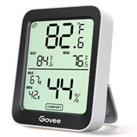

# Govee H5075 Smart Thermo-Hygrometer

The Govee H5075 thermostat + humidity sensor is a small, AAA-battery powered smart sensor. It sends data over advertisements and does not need to be connected.

# Example

# Connecting

Unlike most other Bluetooth device, you must scan for the Govee device using the "BLE Advertisements and beacons" settings. In the app, click Scan if needed to stop the scan. Then select the Settings and set the "Show which device" to "BLE Advertisements and beacons" and click OK. Now click Scan to start scanning and wait for the Govee device to show up (might take up to a minute).

Click on the device to see the display. The app doesn't scan indefinitely for data; you will need to click 'Scan' every so often to keep the data moving into the app.

# Useful Links

* [Govee](https://us.govee.com/products/govee-bluetooth-hygrometer-thermometer-h5075)
* [Github API](https://github.com/Heckie75/govee-h5075-thermo-hygrometer/blob/main/API.md)
* [Github](https://github.com/wcbonner/GoveeBTTempLogger) or [Github ble_monitor](https://github.com/custom-components/ble_monitor)
* [Govee](https://us.govee.com/products/govee-bluetooth-indoor-thermo-hygrometer) compares their current sensors
