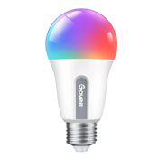

# Instructions for this file

This is just a template help file; you will need to edit it to add additional information.

Instructions for this help file:

1. Copy the final version of this file to Assets/HelpFiles
2. Make sure to add it in Visual Studio, and set the "Copy to Output Directory" to "Copy if newer"
3. Add a link to the Help.md file ** [ihoment_H6005_](Device_Govee_H6005.md) **
4. Add a link to the Welcome.md file ** [](Device_Govee_H6005.md) **
5. Create an Assets/DevicesPictures/Govee_H6005-175.png and Assets/DevicesPictures/Govee_H6005-350.png. The -175 needs to be 175x175 pixels and the -350 file needs to be 350x350 pixels.
6. Make sure to add it in Visual Studio, and set the "Copy to Output Directory" to "Copy if newer"
7. Create an Assets/ScreenShots/Device_Govee_H6005.PNG file
8. Make sure to add it in Visual Studio, and set the "Copy to Output Directory" to "Copy if newer"

Instrutions for adding new devices

1. Move the Protocol file to BluetoothProtocols/BluetoothProtocols
2. Move the XAML and XAML.CS files to BluetothDeviceController/SpecialtyPages
3. Add the specialization to  **mainpage.xaml.cs** about line 90-135 add a specialization line like ```            new Specialization (typeof(SpecialtyPages.Govee_H6005Page), new string[] { "ihoment_H6005_" }, , "", ""),```
4. Compile and run!
5. Update the help_version.md file in Assets/HelpFiles!


-------------- start of file -------------

# The ihoment_H6005_  from 


The Govee H6055 bulb is a standard lightbulb that accepts Bluetooth commands

## Pairing and using the device


## Helpful Links

* [https://us.govee.com/products/govee-smart-bluetooth-rgbww-led-bulbs?_pos=1&_sid=58c8705e1&_ss=r](https://us.govee.com/products/govee-smart-bluetooth-rgbww-led-bulbs?_pos=1&_sid=58c8705e1&_ss=r)
* [https://github.com/chvolkmann/govee_btled/blob/master/govee_btled/bluetooth_led.py](https://github.com/chvolkmann/govee_btled/blob/master/govee_btled/bluetooth_led.py)
* [https://github.com/Beshelmek/govee_ble_lights/blob/master/custom_components/govee-ble-lights/light.py](https://github.com/Beshelmek/govee_ble_lights/blob/master/custom_components/govee-ble-lights/light.py)
