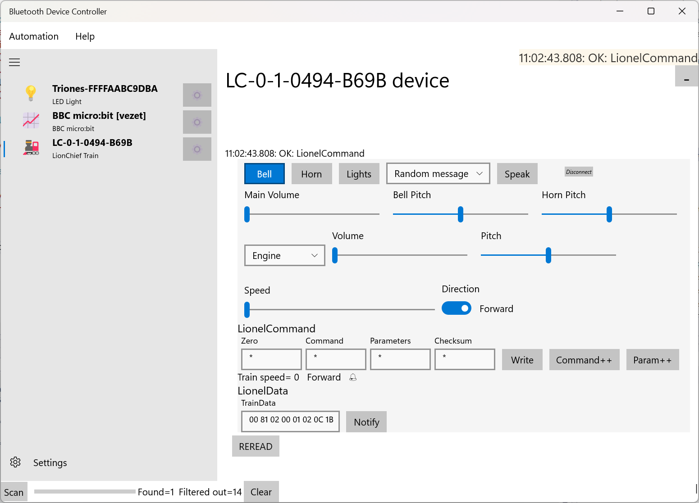

# The Lionel LionChief Bluetooth Train

LionChief is the name of the Lionel company's Bluetooth train control system. New Lionel trains are all fitted with this system, sometime alongside other non-Bluetooth control systems. Given the number of Lionel trains, this has not been tested with all trains, and may not be compatible with all Lionel LionChief trains.

## Pairing and using the device

The device uses Bluetooth LE without pairing.

The list of spoken commands will be different from one train to the next.

## Helpful Links

* [Lionel](http://www.lionel.com/bluetooth/)
* [https://github.com/Property404/lionchief-controller](https://github.com/Property404/lionchief-controller)
* [https://github.com/idaband/lionchief-controller-raspberrypi](https://github.com/idaband/lionchief-controller-raspberrypi)
