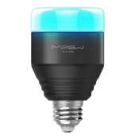

# Mipow Playbulb BTL201 Smark LED

The Mipow Playbulb is a smart Bluetooth-enabled LED light. There are 
several varieties; the BTL201 has been tested with this program.

# Setting Color

# Links
Some useful links to learn more about the Mipow Playbulb

* [Mipow Web Site](https://www.mipow.com/collections/smart-lighting-selection/products/mipow-smart-bulb)
