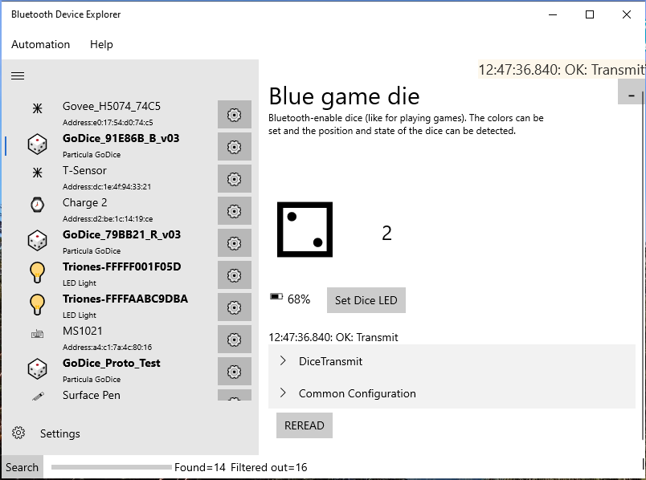

# Particula GoDice 6-sided dice

The Particula GoDice are normal-looking 6-sided dice that include Bluetooth commands. You can get the current dice roll state as the die is being thrown and can set the LED colors. This app doesn't include any of the games that Particula offers; it just shows the value of a single dice.

# Standard screen

Every time you roll a die, the results will show up on the screen with both an image and the number. Also shown is the last known battery level; click the battery percent for it to update. 

You can also click the 

# Links
Some useful links to learn more about the Particula GoDice

 * [Go by Particula](https://getgocube.com/about/)
 * [Kickstarter](https://www.kickstarter.com/projects/1928372437/godice-your-favorite-dice-games-reimagined)
 * [IndieGoGo](https://www.indiegogo.com/projects/godice-incredibly-smart-connected-dice#/)
 * [Google Play app](https://play.google.com/store/apps/details?id=com.particula.godice&gl=US)
 * [GitHub](https://github.com/ParticulaCode/GoDiceJavaScriptAPI)
 * [FCC registration](https://fccid.io/2ASMEGDN1)