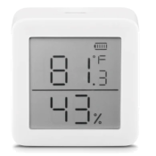

# The SwitchBot MeterTH Sensor from SwitchBot

The SwitchBot MeterTH is a thermostat + hygrometer (humidity) sensor is a small, AAA battery powered smart sensor. It sends data over advertisements and does not need to be connected.

## Pairing and using the device

The device uses Bluetooth LE advertisements

## Helpful Links

* [switch-bot](https://us.switch-bot.com/products/switchbot-meter)
