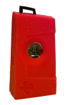

# TI SensorTag CC2541 (2013)

This is the original TI SensorTag and is now obsolete. The SensorTag was a small device
created by TI in order to demonstrate the cababilities of their CC241 processor when 
dealing with a variety of on-board sensors. 

# Pairing (code 0) and usage details
The device must be paired with Windows before it can be used. The default pairing code is 0.

The SensorTag can be a little finicky to connect; sometimes you have to try several times, 
pressing the pairing button. 

If you are creating your own program to read SensorTag data, you have to do a two-step setup to 
get data. You have to both enable the sensors with the configure option and must also enable 
the Bluetooth notifications. This is done for you automatically in the program.

The battery is awkward to remove. I use a small "shover" to push the battery out.

# Sensor Details
The device inludes the following sensors. They are all functional in the specialization page except 
for the pressure sensor (barometer). The raw barometer data is display, but not the final calculated
values.

* [**TMP006** IR Temperature Sensor](http://www.ti.com/product/tmp006) from Texas Instruments
* [**SHT21** Humidity Sensor](http://www.sensirion.com/en/products/humidity-temperature/humidity-sensor-sht21/) from Sensirion
* [**T5400** Pressure Sensor](http://www.epcos.com/inf/57/ds/T5400.pdf) from Epcos
* [**KXTJ9** Accelerometer](http://www.kionix.com/accelerometers/kxtj9) from Kionix
* [**IMU-3000** Gyroscope](http://www.invensense.com/mems/gyro/imu3000.html) from InvenSense
* [**MAG3110** Magnetometer](http://www.freescale.com/webapp/sps/site/prod_summary.jsp?code=MAG3110) from Freescale
 
