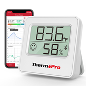
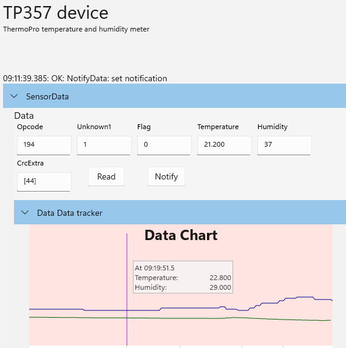

# The TP357  from ThermoPro

ThermoPro temperature and humidity meter is a small, battery powered indoor temperature and humity meter.

## Pairing and using the device

The device does not need to be paired. It will show up as a TP357 in the app.

## Helpful Links

* [https://buythermopro.com/product/tp357/](https://buythermopro.com/product/tp357/)
* [https://buythermopro.com/wp-content/uploads/2021/07/Thermopro-EN-FR-TP357-UM-20210309.pdf](https://buythermopro.com/wp-content/uploads/2021/07/Thermopro-EN-FR-TP357-UM-20210309.pdf)
* [https://github.com/pasky/tp357](https://github.com/pasky/tp357)
* [https://github.com/zett90/tp357-browser-view/blob/2efdd3ca726f65c554d0674da70538ec79567061/app/src/utils/thermoPro.js#L11](https://github.com/zett90/tp357-browser-view/blob/2efdd3ca726f65c554d0674da70538ec79567061/app/src/utils/thermoPro.js#L11)
