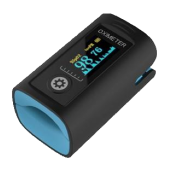

# Viatom PC-60FW Pulse Oximeter

The Viatom Pulse Oximeter, model PC-60FW, is a fingertip pulse oximeter. It can provide information on your pulse rate and oxygen levels (%SpO2) plus a more technical reading called the Perfusion Index (PI).

When a Viatom Pulse Oximeter is detected, the app will automatically show the resulting information.

# Connecting

The Viatom Pulse Oximeter does not normally need to be paired.

# Useful Links

* [Viatom](https://www.viatomtech.com/pc-60fw)

