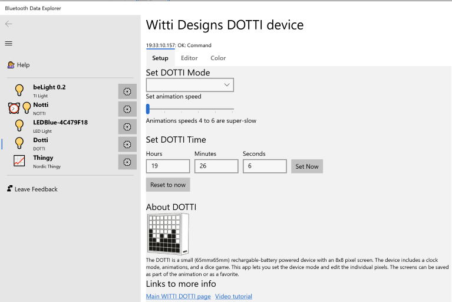
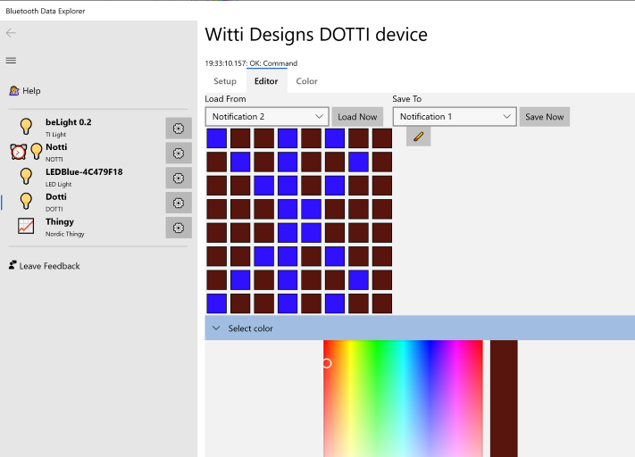
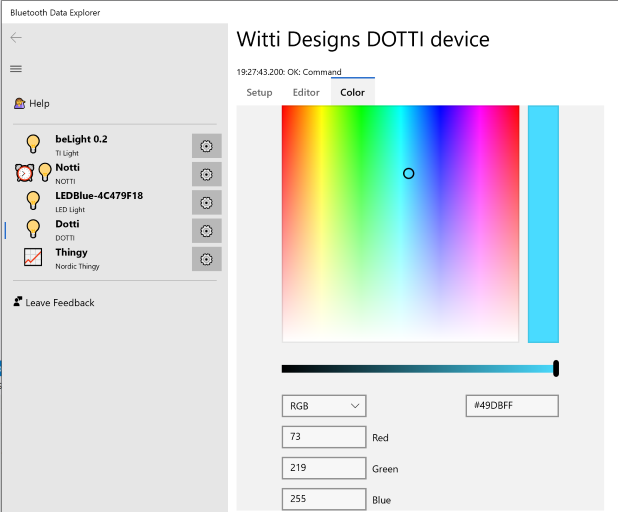

# Witti Dotti device

The [Witti Dotti](https://www.wittidesign.com/products/dotti-one) is a small rechargable-battery
powered 8x8 array of LEDs. Each LED can be set to a different color, forming pictures.
The Dotti includes some built-in "apps" so that you can shake it to roll for a dice, 
and a clock.

# Setup screen

The Dotti is designed with several different "apps" built in. The Setup screen is where you can control these.

1. You can set the DOTTI mode. For example, there's an animation mode that uses the animation slots.
2. Set the DOTTI time. Click "reset to now" to set the hours, minutes and seconds values (or enter in your own preference for times), and then press Set Now to set the time.

# Editor

The editor screen lets up you update the built-in set of screens for 
the Dotti. Your normal work flow for the editor is

1. Load a screen. The screen will display on the Dotti but will not display in the editor (that is because the Dotti doesn't have any way for the editor to find out what's on the Dotti screen)
2. Modify the images. Open up the Select Color to pick a color and start drawing.
3. Save the image to one of the predefined slots (e.g. "Notification 1"). When the screen is displayed, it will be your artwork!

# Color

The color screen is the simplest Dotti control screen. Simply pick a color, and the entire Dotti will turn that color.

