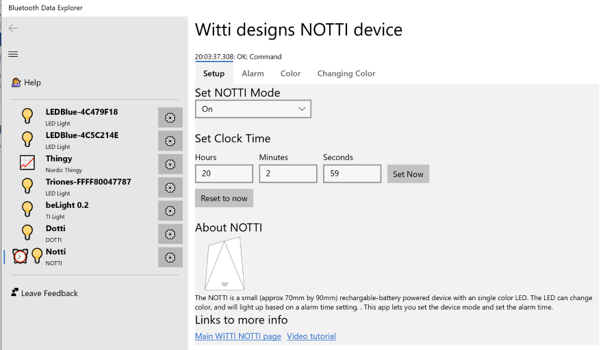
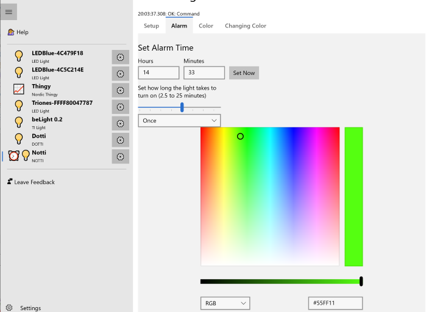
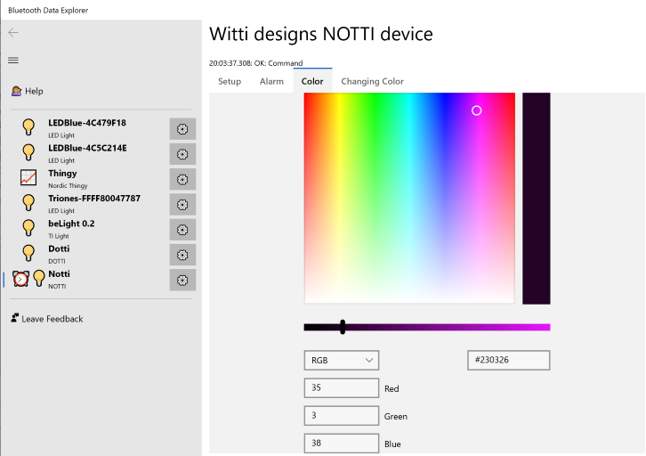
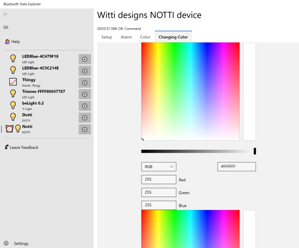

# Witti Notti device

The Notti from Witti designs is a small rechargeable desktop indicator light. You can set
its color and can set it up as an alarm: it will turn on slowly switch to a color you specify
at a time you specify.

There are three or four for Triones devices: setup, alarm, color, and changing color. 

# Setup screen

The Notti is designed with several different "apps" built in. The Setup screen is where you can control these.

1. You can set the NOTTI mode to On or Off
2. Set the NOTTI time. Click "reset to now" to set the hours, minutes and seconds values (or enter in your own preference for times), and then press Set Now to set the time.

Setting the time just sets the "current" time; it doesn't set the alarm time

# Alarm tab

The alarm tab lets you set the arlm time, how slowly to turn the Notti on (to simulate a sunrise, for example), and how often the alarm should run.

Dont forget to press **Set Alarm** to actually set the alarm!

# Color tab

The Color tab lets you set the exact color of the bulb using a color picker. You can
point to the color you want or you can type in the red, green, and blue values directly.

# Changing Color tab

The Changing Color tab lets you set a slow rythm of changing colors on your Notti

# Links
Some useful links to learn more about the Witti Notti device
* [Witti designs](https://www.wittidesign.com/products/notti)
