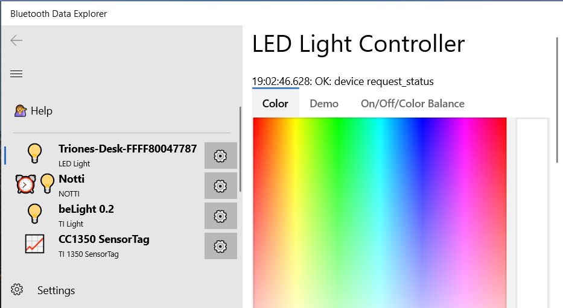

# Bluetooth Device Control Program

Got a Bluetooth device and want to control it? The Bluetooth Device Controller program lets you 

1. It can control many kinds of Bluetooth smart lights
2. It can read data from a variety of different Bluetooth-enabled sensors
3. It can control a small number of robots
4. It can read and control raw Bluetooth LE devices. This is an advanced feature for people who need to get a detailed analysis of their Bluetooth devices.

## The user interface

1. The  Menu button controls whether the menu is all the way open (the default) or mostly closed.
2. The 💁 Help button shows this help
3. The 📜 list of devices shows all of the known Bluetooth devices which have specialized control pages. For example, the program knows about "Triones" compatible lights, and so your existing Triones lights are shown. There are smart bulbs that this program can't control yet; they will not be shown.
4. The  [Settings](Settings.md) button lets you control useful settings for devices

The big pane to the right of the menu is where you control individual lights and data sensors. In this version of
the program, you can only one one light or data sensor at a time.

## Controlling Lights

To control a light, click on it in the menu. Many lights will pop up with several tabs:

1. The Color tab lets you directly set a light's color. Just click in the color widget to set the color.
2. The Demo tab turns on various demo effects. Lights that are compatible with the Triones system will show this tab even though not all Triones compatible bulbs can do the demo effects.
3. On/Off/Color Balance. Many lights are capable or either being in color OR just being a plain white bulb.

### Lights known to be compatible with this program
Not all Bluetooth Smart light bulbs are the same. This program can control some but not all Smart Bluetooth bulbs.

* [Daybetter](Device_Daybetter_LedLight.md)
* [Flux](Device_MagicLight.md)
* [Govee H6005](Device_Govee_H6005.md)
* [Mipow](Device_Mipow_Playbulb_BTL201.md)
* [Magic Light](Device_MagicLight.md) and newer [Magic Light](Device_Zengge_LedLight.md) bulbs
* [TI beLight CC2540](Device_TI_beLight_2540.md)
* [Triones](Device_Triones.md) (includes some Bluetooth strip bulbs)
* [Witti Dotti](Device_Witti_Dotti.md)
* [Witti Notti](Device_Witti_Notti.md)

Bulbs that are definitely not compatible include the C by GE bulb, the Philips Hue bulbs, and all Wi-Fi smart bulbs.

## Reading sensor data

### Sensors known to be compatible
* [BBC micro:bit](Device_Bbc_MicroBit.md)
* [Govee H5074](Device_Govee_H5074.md)
* [Kano Coding Wand](Device_Kano_Wand.md)
* [Nordic Thingy](Device_Nordic_Thingy.md)
* [Pyle PHBPBW40](Device_Samico_BloodPressure_BG512.md)
* [RuuviTag](Device_Ruuvi_RuuviTag.md)
* [Sensything](Device_Protocentral_Sensything.md)
* [SwitchBot MeterTH](Device_SwitchBot_MeterTH.md)
* [TI SensorTag 1352](Device_TI_SensorTag_1352.md), also known as the Multi-Sensor
* [TI SensorTag 1350 and 2650](Device_TI_SensorTag_1350.md)
* [(Obsolete) TI SensorTag 2541](Device_TI_SensorTag_2541.md)

### Learning more
The individual data sensors usually have a host of capabilities. 

* [Reading Data](Sensor_Data_Reading.md)
* [Exporting Data to Excel](Sensor_Data_Excel.md)

## Controlling Robots
There are a wide variety of Arduino-type robots and devices that can potentially be controlled. 
Right now, the following list has been verified as controllable with this program

* [Crafty Robot Smartibot](Device_CraftyRobot_Smartibot.md)
* [Elegoo MiniCar](Device_Elegoo_MiniCar.md)
* [Reality Robotics BERO](Device_RealityRobotics_Bero.md)
* [Slant Robotics LittleBot](Device_SlantRobotics_LittleBot.md)
* [William Weiler Engineering Skoobot](Device_WilliamWeilerEngineering_Skoobot.md)

## Programmable Devices
There are a wide variety of Espruino and other programmable Bluetooth devices. This program will
recognize devices that use the Nordic UART system; this includes many of the Espruino-based
devices that are programmable in JavaScript.

* [Puckjs](Device_Espruino_Puckjs.md)

## Toys, Games and Other devices
Other devices that can be controled with this program include

* [Particula GoDice](Device_Particula_GoDice.md)
* [Lionel LionChief](Device_Lionel_LionChief.md)

## Protocol details

[JSON Description Protocol](Json_About.md)

[Welcome](Welcome.md)