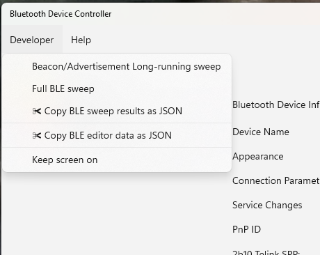

# Menu Bar: **Developer**

The Developer menu is used by people who want to explore Bluetooth device advertisements nearby. 

## Beacon/Advertisement Long-running sweep

Runs a continuous sweep of Bluetooth advertisements. Normally when you scan advertisements, the scan stops after a minute or two. This is awkward when you're making continuous readings of an advertisement-based data sensor (like the SwitchBot thermometer/hygrometer).

## Full BLE Sweep

Does a sweep of all Bluetooth Low-Energy (BLE) devices. Each device will be queried for its services and characteristics. When the sweep is completed (generally after a minute or two), the results will be converted to JSON and shown in a small dialog box. From there you can copy the data to clipboard for later analysis.

## ✀ Copy BLE sweep results as JSON

You can copy the entire results of the Full BLE sweep (even while it's in progress) with the Copy BLE sweep results as JSON button. This command will write the results to the clipboard without showing any user interface.

## ✀ Copy BLE editor data as JSON

Copies the current device information. This is only enabled when the BLE editor is enabled. The information is copied as JSON in the standard format for customization.

## Keep screen on

Select this item to keep the screen on. When selected, it will have a check-mark next to it.Normally in Windows your laptop screen will turn off after a short while with no activity. This will interfere with long-running data collection attempts (e.g., tracking temperature and humidity data for an entire day).

Note that keeping your screen on will use more power.

# See also:

* **[Developer](Help_Menu_Developer.md)** for features for Bluetooth developers to sweep for and record Bluetooth advertisements and devices
* **[Filter](Help_Menu_Filter.md)** (in *Advertisement* mode only) to sort the Bluetooth advertisements 
* **[Help](Help_Menu_Help.md)** to provide help about the program and to provide feedback

