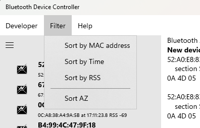

# Menu Bar: **Filter**

The Filter menu lets you filter Bluetooth advertisements. The menu will only be shown while you're scanning for Bluetooth advertisements; it won't show up for Bluetooth LE scans or for COM port scans.

You can sort by

* **MAC address** where the MAC address is the 6 digit Bluetooth address of the device. (for example, 52:A0:E8:83:A9:11).

* **Time** will sort the advertisements in the order in which they were detected

* **RSS** will sort by the *Recieved Signal Strength*. The Signal strength is reported in *decibels* and will be a negative number like **-49** (stronger signal) or **-93** (weaker signal). In general, a stronger signal means that the device is closer. 

You can pick to sort in ascending or descending order with the **Sort AZ** selection.

# See also:

* **[Developer](Help_Menu_Developer.md)** for features for Bluetooth developers to sweep for and record Bluetooth advertisements and devices
* **[Filter](Help_Menu_Filter.md)** (in *Advertisement* mode only) to sort the Bluetooth advertisements 
* **[Help](Help_Menu_Help.md)** to provide help about the program and to provide feedback

