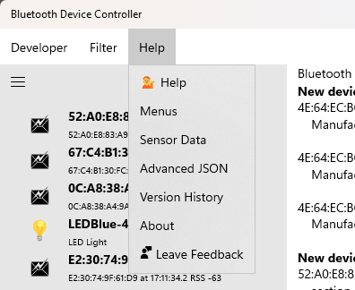
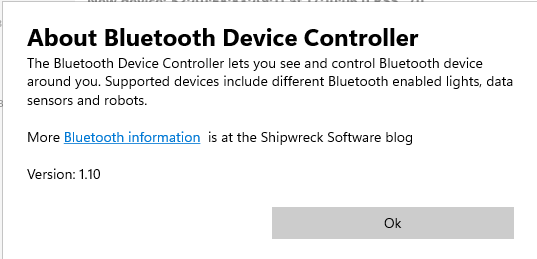

# Menu Bar: **Help**

The Help menu lets you jump directly to important HELP topics

* **Help** provides an overview of the Bluetooth Device Controller app
* **Menus** provides detailed help on each menu entry
* **Sensor Data** shows how to analysize, save, and copy to Excel the sensor data
* **Advanced JSON** shows developer details about the JSON Bluetooth description format
* **Version History** provides information on version updates to the app
* **About** shows a small dialog box that includes the app version number
* **Leave Feedback** takes you to the Windows Feedback Hub to provide feedback on this app

# See also:

* **[Help About](Help_Menu_Help_About.md)** for link to the blog and current version number 
* **[Developer](Help_Menu_Developer.md)** for features for Bluetooth developers to sweep for and record Bluetooth advertisements and devices
* **[Filter](Help_Menu_Filter.md)** (in *Advertisement* mode only) to sort the Bluetooth advertisements 
* **[Help](Help_Menu_Help)** to provide help about the program and to provide feedback

