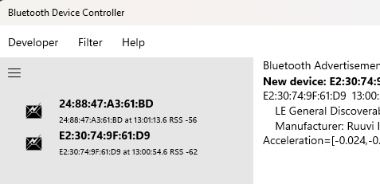

# Menu Bar: Developer Filter Help

The **Menu Bar** along with the [**Settings**](Settings.md) dialog lets you control how the Bluetooth Device Controller functions. The menu choices are

* **[Developer](Help_Menu_Developer.md)** for features for Bluetooth developers to sweep for and record Bluetooth advertisements and devices
* **[Filter](Help_Menu_Filter.md)** (in *Advertisement* mode only) to sort the Bluetooth advertisements 
* **[Help](Help_Menu_Help.md)** to provide help about the program and to provide feedback

