# Welcome to the Bluetooth Device Controller

Thanks for trying the Bluetooth Device Controller. This first version 
has just the basics for controlling and discovering many of the Bluetooth
devices that are around you. Future version will include more capabilities 
and more devices -- please leave feedback to request specific devices!

## Lights that can be controlled

[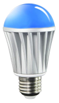](Device_MagicLight.md)

[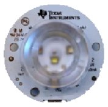](Device_TI_beLight_2540.md)

[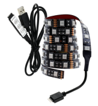](Device_Triones.md)

## Data sensors that can be read
[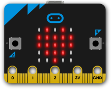](Device_Bbc_MicroBit.md)

[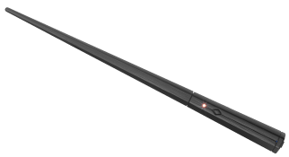](Device_Kano_Wand.md)
[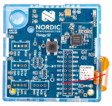](Device_Nordic_Thingy.md)
[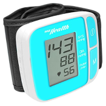](Device_Samico_BloodPressure_BG512.md)
[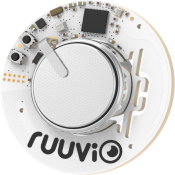](Device_Ruuvi_RuuviTag.md)
[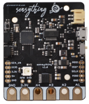](Device_Protocentral_Sensything.md)
[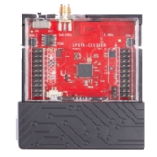](Device_TI_SensorTag_1352.md)
[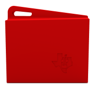](Device_TI_SensorTag_1350.md)

## Robot devices
[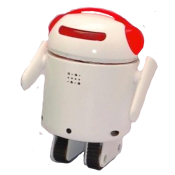](Device_RealityRobotics_Bero.md)
[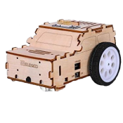](Device_Elegoo_MiniCar.md)
[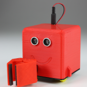](Device_SlantRobotics_LittleBot.md)

## Programmable devices

[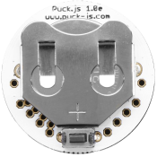](Device_Espruino_Puckjs.md)

## Toys and games

[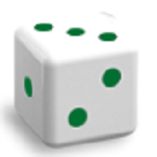](Device_Particula_GoDice.md)
[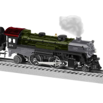](Device_Lionel_LionChief.md)

## More help
[Help](Help.md)