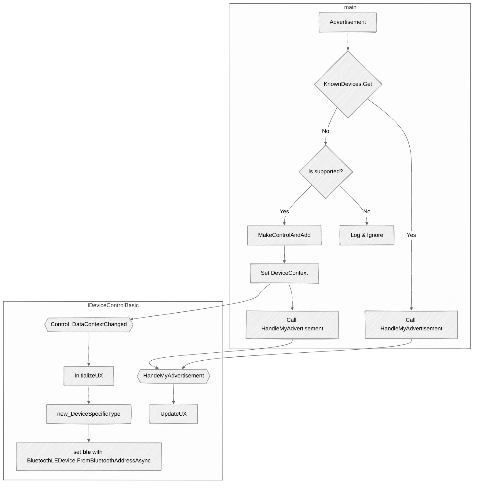

# Connection control and device lifetime

|Bluetooth call|State|Error|New State|Notes
|----|----|----|
|BluetoothLEDevice.FromBluetoothAddressAsync|Control Initializing|NoBLE| ?? | Total failure

```mermaid
---
config:
  look: handDrawn
  theme: neutral
---
flowchart TD
subgraph main
A[Advertisement] --> CheckKnown{KnownDevices.Get}
CheckKnown --> |No| CheckSupported{Is supported?}
CheckKnown --> |Yes| Call_HandleMyAdvertisement1
CheckSupported -->|Yes| MakeControlAndAdd
CheckSupported -->|No| NotSupported[Log & Ignore]
MakeControlAndAdd --> Call_Set_DeviceContext
Call_Set_DeviceContext --> Call_HandleMyAdvertisement2
end
subgraph IDeviceControlBasic
Call_HandleMyAdvertisement1[Call HandleMyAdvertisement] 
	--> HandleMyAdvertisement
Call_HandleMyAdvertisement2[Call HandleMyAdvertisement] 
	--> HandleMyAdvertisement
Call_Set_DeviceContext[Set DeviceContext] --> Control_DataContextChanged 
Control_DataContextChanged{{Control_DataContextChanged}} --> InitializeUX
InitializeUX --> new_DeviceSpecificType
new_DeviceSpecificType 
	--> ble_BluetoothLEDevice.FromBluetoothAddressAsync["`set **ble** with BluetoothLEDevice.FromBluetoothAddressAsync `"]


HandleMyAdvertisement{{HandeMyAdvertisement}} --> UpdateUX

end
```