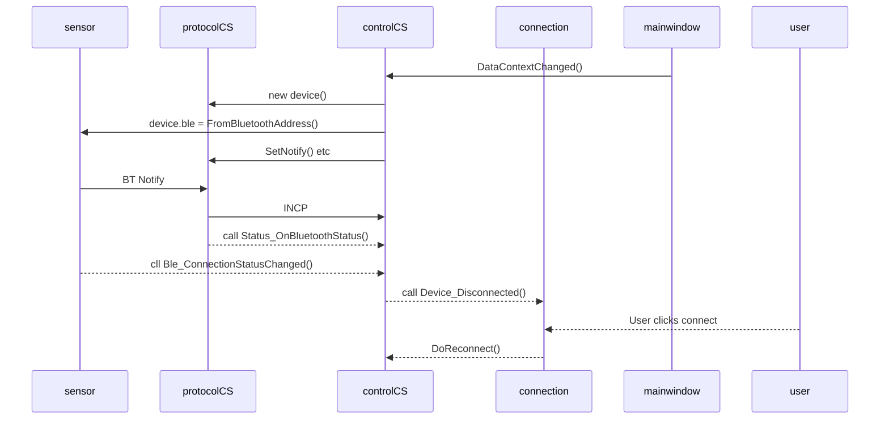
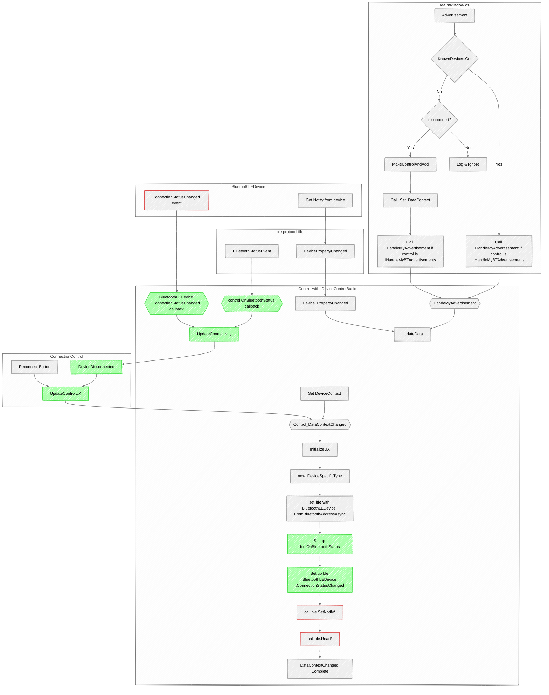

# Connection control and device lifetime

## TODO list for the connection control

- The connection control is ugly
- Add a connect ring
- DONE On status failures, disconnect
- DONE On device disconnect, set to disconnected
- On timer, reconnect

## Code that sets status

|Bluetooth call|State|Error|New State|Notes
|----|----|----|
|BluetoothLEDevice.FromBluetoothAddressAsync|Control Initializing|NoBLE| ?? |Unlikely Total failure
|ble.SetNotify*|Control Initializing|NoBLE| ?? |Unlikely total failure
|ble.Read*|Control Initializing|NoBLE| ?? |Unlikely total failure

## Sequence Diagram: connect and status flows

In the sequence diagram

* **sensor** is the Windows [BluetoothLEDevice](https://learn.microsoft.com/en-us/uwp/api/windows.devices.bluetooth.bluetoothledevice?view=winrt-28000) device
* **protocolCS** is the protocol file that's generated from the protocol JSON file
* **controlCS** is the UserControl-derived object for the device. This is the large file with the OxyPlot, table, etc. code for UX
* **connection** is the BTConnectionControl. Most of the controlCS files include a BTConnectionControl for convenience.
* **mainwindow** is the MainWindow. It has the AdvertisementWatcher that triggers the creation of a Known device when the right advertisements are seen
* **user** is the user. They click a button sometimes :-)

## Flowchart for Bluetooth connection and data

